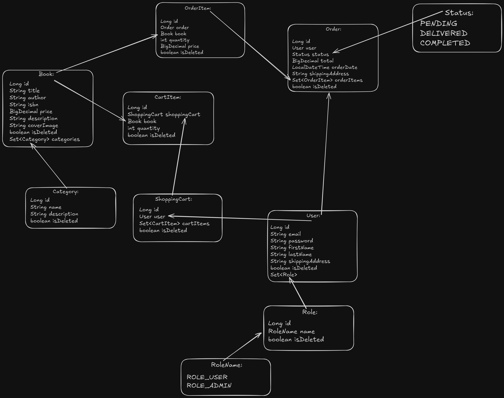

# JV Online Book App API

The **JV Online Book App API** is a comprehensive backend application that provides an API for managing books, categories, orders, and shopping carts. This project was created to simplify the management of a large number of books in an online store by offering an easy-to-use set of API interfaces. The application supports CRUD (Create, Read, Update, Delete) operations and allows searching for books based on defined criteria.

## Technologies and Tools

This project utilizes a range of advanced technologies and tools to create a secure, efficient, and scalable API:

- **Spring Boot 3.3.1** - Enables rapid development of Java applications with minimal configuration.
- **Spring Security 6.3.1** - Ensures secure access to the API through authorization and authentication.
- **Spring Data JPA** - Simplifies data management using Java Persistence API.
- **Swagger (Springdoc OpenAPI)** - Automatically generates API documentation.
- **MapStruct** - Facilitates the mapping of DTO objects within the application.
- **JWT (JSON Web Token)** - Implements JWT tokens for secure authentication.
- **Liquibase** - Manages database migrations and schema versioning.
- **Hibernate Validator** - Validates input data.
- **Testcontainers** - Creates isolated testing environments using Docker containers.
- **H2 Database** - Used for testing purposes.
- **MySQL** - Used as the database in the production environment.
- **Lombok** - Reduces boilerplate code by automatically generating getter, setter, and other methods.
- **Checkstyle** - Ensures code compliance with coding standards.

## Features

The controllers in this application are designed with usability and security in mind:

- **AuthenticationController** - Manages user registration and login.
- **BookController** - Provides full CRUD operations on books and allows searching based on various criteria.
- **CategoryController** - Enables the creation, editing, deletion, and viewing of book categories, as well as viewing books assigned to specific categories.
- **OrderController** - Manages the order placement process and order history viewing.
- **ShoppingCartController** - Allows users to manage their shopping cart, including adding, editing, and removing items.

## Visualization

## Configuration Instructions

#### System Requirements

- Java 17
- Maven 3.8+
- MySQL 8.0+

#### Setup Steps

1. Check if you have Git installed: git --version
2. Clone the repository (You can use SSH): git clone git clone git@github.com:...

Alternatively, if you prefer to use HTTPS, the command would be: git clone https://...
3. Navigate into the cloned repository: cd jv-Online-Book-App-API
4. (Optional) Check the repository status: git status

### Build the project:

mvn clean package
## Login Credentials For Default Users

### Admin:

Email: admin@admin.com
Password: password

### User:

Email: john.doe@example.com
Password: 123456
### After starting the application, the API documentation will be available at:

http://localhost:8080/swagger-ui.html
